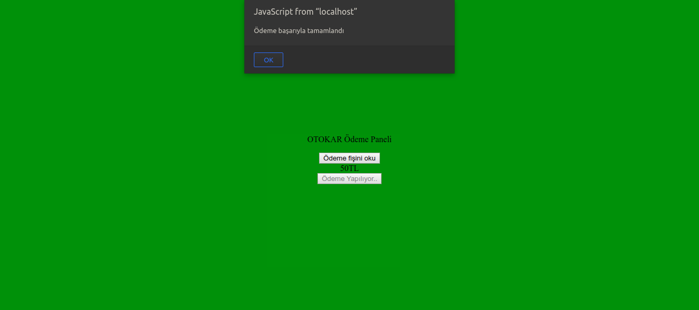

# ALTAY PAY
Payment system for Turkish Tanks which eliminates the need to leave the tank for tank personnel.


## RUN
Install dependencies with ```npm install``` command then run ```npm start``` comand from your terminal.


## API
**/api/get-payment-qr**


requestBody:
```javascript
{
  "amount": 50
}
```

responseBody:
```javascript
{
  "returnCode":1000,
  "returnDesc":"OK",
  "QRdata":"000201530394954045000800201810200821912-11-2019 23:32:34830524-338609800-5000#8734ECd56a02772ee34ae597c8467abeda984d890118405258658844secureqrsigniturewillbehereinthenearfuture1="
}
```


**/api/payment**


requestBody:
```javascript
{
	"qrString": "000201530394954045000800201810200821912-11-2019 23:32:34830524-338609800-5000#8734ECd56a02772ee34ae597c8467abeda984d890118405258658844secureqrsigniturewillbehereinthenearfuture1="
}
```


responseBody:
```javascript
{
  "applicationID": "api",
  "sessionID": "417",
  "posID": "AT0000000001",
  "returnCode": 1000,
  "returnDesc": "OK"
}
```

**Note:** While our API makes call to arçelik servers from this link, it should be using 'paymentProcessorID' parameter but i did not recieve this ID so if we use the sample ID on the documents we recieve authentication error. Because of that I return a sample response from this link. But it is already completed and capable of work if we use a real ID.

## HOW
I did not just simulate the Tank Panel, but also simulated Pos Machine Panel. These two pages are communicating via WebSocket.

First, we are opening our pos panel. Entering the price.

Pressing on 'Fiş Oluştur'.

This makes a request to **/api/get-payment-qr** on our api. When it completes we get this screen:

Before we click onto 'Fişi okut', we should activate Tank's system. Order here is **important**.


Now we can click onto 'Fişi okut'. After that we will come to this screen:

We can see the amount here. (Also, we can read another bill without paying. This prevents the system getting stuck on the payment process. We can change the amount etc.). When we click 'Öde', it makes a call to **/api/payment** on our api.
